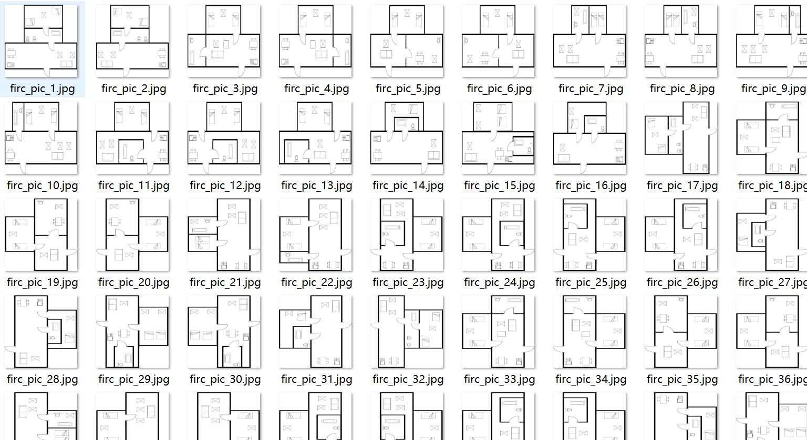
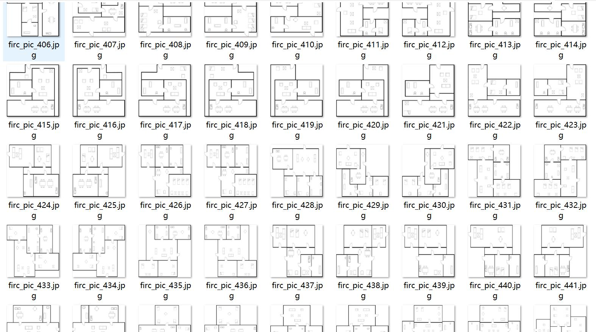
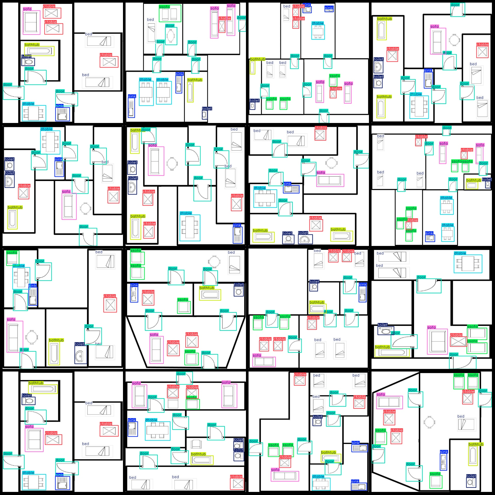
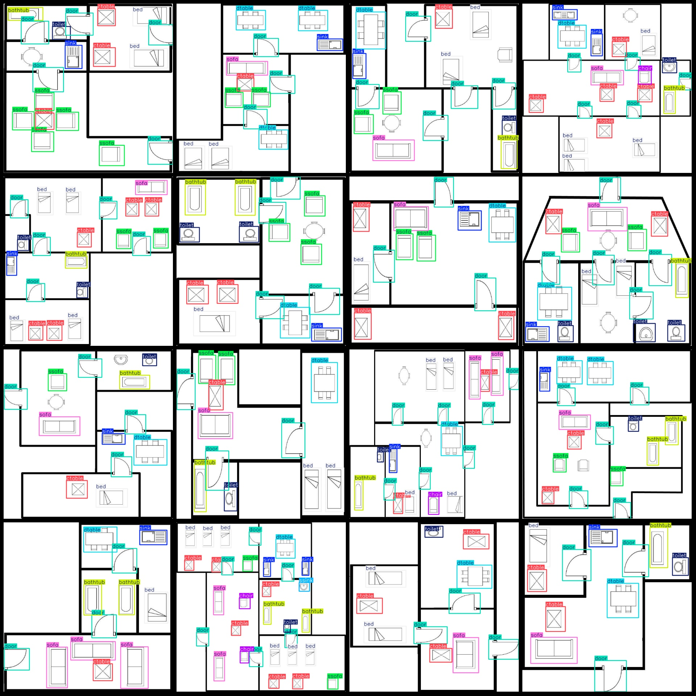

# Vision Dataset of Indoor Furniture in 770 Images with 12 Categories

The dataset format is Pascal VOC with YOLO format (txt files without split paths, only containing jpg images and corresponding VOC XML files and YOLO txt files).

Number of images (jpg files): 770
Number of annotations (xml files): 770
Number of annotations (txt files): 770
Number of annotation categories: 12
Annotation category names (note that the order in YOLO format does not correspond to this, but rather based on the "labels" folder's "classes.txt"): ["achair", "bathtub", "bed", "chair", "ctable", "door", "dtable", "sink", "sofa", "ssink", "ssofa", "toilet"]
Number of bounding boxes per category:
- achair (armchair) = 17, occupied images = 6
- bathtub (shower) = 937, occupied images = 726
- bed (bed) = 1512, occupied images = 741
- chair (chair) = 222, occupied images = 132
- ctable (coffee table/tea table) = 1997, occupied images = 750
- door (door) = 3313, occupied images = 770
- dtable (dining table) = 843, occupied images = 687
- sink (sink) = 977, occupied images = 717
- sofa (sofa) = 1032, occupied images = 719
- ssink (single sink) = 20, occupied images = 20
- ssofa (single sofa) = 1369, occupied images = 593
- toilet (toilet) = 930, occupied images = 705
Total bounding boxes: 13169
Image resolution: 640x640
Annotation tool used: labelImg
Annotation rules: draw rectangle boxes for each class
Important note: The dataset does not have been divided into training, validation, or test sets; it needs to be manually split.
Special declaration: This dataset does not guarantee the accuracy of the models trained or the weights file.
Image preview:

Here is a pay link on Stripe ( https://buy.stripe.com/3cs8yP7sY87d0vu9AB ). Please contact me lonlonago@foxmail.com after funding $89, and I will send you a complete data files , thank you!

